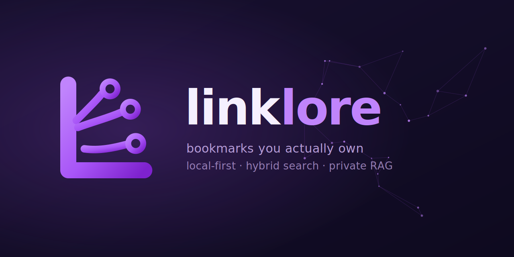
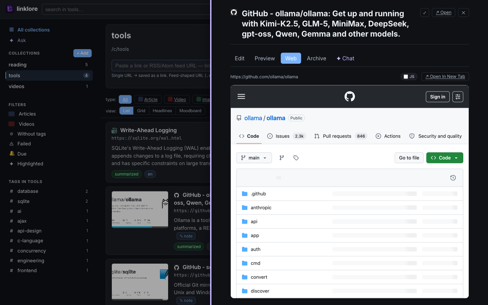
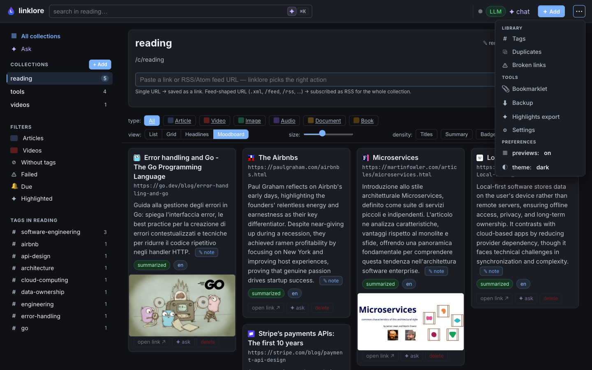

<p align="center">
  
</p>

# Linklore

[](https://github.com/gabriele-mastrapasqua/linklore/actions/workflows/test.yml)
[](https://github.com/gabriele-mastrapasqua/linklore/actions/workflows/release.yml)
[](#tests)
[](https://goreportcard.com/report/github.com/gabriele-mastrapasqua/linklore)
[](go.mod)
[](LICENSE)
[](#local-first-privacy-first)

> **Bookmarks you actually own.** A local-first, single-binary library for
> the links you save — full-text + semantic search across everything,
> a private RAG chat grounded on your own content, four view modes,
> RSS/Atom subscriptions, dead-link checker, drag-and-drop. SQLite under
> the hood. No accounts. No SaaS. No telemetry.
>
> **One Go binary. One SQLite file.** No Node, no npm, no JS build
> chain, no Docker compose, no Postgres, no Redis. The whole thing
> is ~14 MB and starts in under a second.


> Screenshots in this README are taken from a curated public demo
> library — generate yours with `make seed-demo`.

---

## Local-first, in one paragraph

Your data is one SQLite file. Migration is `cp`. No accounts, no SaaS,
no telemetry. The LLM is optional and points at any OpenAI-compatible
server you run yourself (vLLM, llama.cpp, LM Studio, or any other
`/v1` endpoint) — or skip the LLM entirely and search falls back to
BM25. Binds to `127.0.0.1` by default; you decide if it ever leaves
the machine.

---

## Why

Browser bookmarks rot. Read-later apps lock your data behind an account.
Self-hosted bookmark managers ship a Docker compose, a Postgres, a
Redis, and a JS build chain.

Linklore is one Go binary and one SQLite file. Open it, paste a URL,
forget it. When you want to find something — type, or ask the AI in
plain language. When you want to leave — copy the SQLite file. That's
the migration.

---

## Features

- **Smart capture** — paste a link or RSS/Atom feed; the same field
  handles both. Bookmarklet + Netscape import/export.
- **Four views per collection** — list / grid / headlines /
  Pinterest-style moodboard, persisted server-side. Moodboard
  card width is slider-driven so you can pack 6 columns or stretch
  to 2.
- **Hybrid search** — FTS5 + semantic (cosine on stored embeddings),
  with a clean BM25 fallback when no LLM is around.
- **RAG chat** with inline `[src:N]` citations and a sources rail that
  dims retrieved-but-unused chunks.
- **Per-link AI** — TL;DR + auto-tags on ingest. Optional; off by
  default.
- **Reader drawer** — in-place preview with size / width /
  light-sepia-dark.
- **Web preview that actually loads** — a same-origin proxy strips
  `X-Frame-Options` / `frame-ancestors`, injects a `<base>` so CSS
  + images resolve against the upstream, and (by default) neutralises
  scripts so SPA routers can't bounce the page off its first paint.
  Toggle JS back on per page if a site needs hydration.
- **Raindrop-style sidebar** — Collections is the hero, capped at 50
  vh with a themed scrollbar; Library + Tools + theme/preview toggles
  live in the topbar overflow menu so the sidebar stays focused.
- **Type filter** — article / video / image / audio / document / book
  chips per collection.
- **⌘K palette**, `j/k` keyboard nav, right-click menu, drag-and-drop
  reorder, light/dark/auto theme.
- **Duplicates view** with URL canonicalisation (strips `www.`,
  trailing slash, fragment, `utm_*`, 17 other tracker keys).

---

## Screenshots

The two views the project is built around: a Pinterest-style moodboard
of your saved links (the hero above), and a RAG chat that answers
questions in the language of your library and cites the exact source
chunk it used.

<table>
<tr>
<td colspan="2"><strong>Chat with your library</strong> — streaming answer with inline <code>[src:N]</code> citations. The sources rail on the right highlights the chunks the model actually used and dims the ones that were retrieved but irrelevant. Powered by hybrid FTS5 + embedding retrieval over your own SQLite.<br></td>
</tr>
<tr>
<td width="50%"><strong>Collection — list view</strong><br>Favicon + LLM summary + tags + a single big hero image per row. Sidebar leads with All collections + Ask, Collections is the visual anchor with a primary <code>+ Add</code> pill.<br></td>
<td width="50%"><strong>Reader drawer</strong><br>Slide-in preview with size / width / theme controls + a TL;DR card.<br></td>
</tr>
<tr>
<td width="50%"><strong>Web preview — proxied</strong><br>Same-origin proxy strips <code>X-Frame-Options</code>, injects a <code>&lt;base&gt;</code>, and disables JS by default so the SSR'd first paint stays put. Pages other readers can't embed render here, fully styled.<br></td>
<td width="50%"><strong>Topbar overflow menu</strong><br>Tags, Duplicates, Broken links, Bookmarklet, Backup, Highlights export, Settings, plus theme + previews toggles — all behind one <code>⋯</code> so the sidebar stays focused on Collections.<br></td>
</tr>
<tr>
<td width="50%"><strong>Type filter</strong><br>Per-collection chips: article / video / image / audio / document / book.<br></td>
<td width="50%"><strong>⌘K command palette</strong><br>Fuzzy-search every link, every collection, every page.<br></td>
</tr>
</table>

---

## Install

### Pre-built binaries (recommended)

Grab a release archive from the
[releases page](https://github.com/gabriele-mastrapasqua/linklore/releases/latest)
for your OS/arch — `linux-amd64`, `linux-arm64`, `darwin-amd64`,
`darwin-arm64`, or `windows-amd64`. Each archive bundles the binary,
`README.md`, `LICENSE`, and `configs/config.yaml`.

```bash
# example: macOS arm64
curl -LO https://github.com/gabriele-mastrapasqua/linklore/releases/latest/download/linklore-<version>-darwin-arm64.tar.gz
tar -xzf linklore-*-darwin-arm64.tar.gz
./linklore-*-darwin-arm64 serve
```

Open `http://127.0.0.1:8080`. That's the whole onboarding.

### From source

You need **Go 1.25+** and `make`. An LLM is optional — Linklore boots
cleanly without one.

```bash
git clone git@github.com:gabriele-mastrapasqua/linklore.git
cd linklore
make build           # ./bin/linklore (~14 MB)
make run             # serves on http://127.0.0.1:8080
```

Want a local LLM (RAG chat + per-link TL;DR)? Two extra steps:

```bash
make env-template    # cp .env.example → .env (skips if .env exists)
$EDITOR .env         # fill in OPENAI_BASE_URL, OPENAI_API_KEY, model names
```

See **[Configuration](#configuration)** below for the env-var values.

### Dev loop

```bash
make dev             # reset DB + build + run (handy when iterating)
make test            # full suite, race-enabled, fts5 tag — what CI runs
make check           # fmt + vet + lint + test (run before commit)
make smoke           # spin up server, hit health + create paths, tear down
make seed-demo       # populate ./data/linklore-demo.db with curated public links
make help            # show every target
```

### CLI

```bash
./bin/linklore serve   [--config configs/config.yaml]
./bin/linklore add     -c <slug> <url>
./bin/linklore reindex
```

---

## Configuration

Linklore splits config across two files with **strict, non-overlapping
responsibilities** so a `git add .` can't ever leak a secret:

| File | Holds | Tracked in git? |
|---|---|---|
| `configs/config.yaml` | Non-secret tunables. | ✓ committed |
| `.env`                | Secrets + per-machine values: LLM endpoint, API key, model names. | gitignored |

The `/settings` page reads the live config and writes LLM changes back
to `.env` only — yaml is **never** touched by the UI save path.

### What's in `configs/config.yaml`

Edit when you want to change a defaults; otherwise ignore it.

```yaml
server.addr                 # default 127.0.0.1:8080
database.path               # default ./data/linklore.db
worker.{concurrency, embed_batch_size, fetch_timeout_seconds}
extract.{headless_fallback, archive_html, min_readable_chars}
chunking.{target_tokens, overlap_tokens, min_tokens}   # RAG knobs
tags.{max_per_link, active_cap, reuse_distance}        # auto-tag caps
ui.{show_images_default, reader_font, reader_width}    # cosmetic defaults
```

### Pick an LLM backend (or skip)

`make env-template` (or `cp .env.example .env`) then fill in one of
the blocks below. **Use `openai` for any local LLM** — point
`OPENAI_BASE_URL` at any server that speaks the OpenAI-compatible
`/v1/chat/completions` + `/v1/embeddings` shape (vLLM, llama.cpp,
LM Studio, OpenAI itself, …). Switching servers is one URL.

> **`OPENAI_API_KEY` is optional.** Leave it empty (or omit it) for
> local servers — linklore won't send an `Authorization` header at
> all. Set a real `sk-...` key only when you talk to the actual
> OpenAI cloud (or to a local server you've protected with auth).

**Local LLM (no key needed):**

```ini
LINKLORE_LLM_BACKEND=openai
OPENAI_BASE_URL=http://localhost:8000/v1     # vLLM / llama.cpp / LM Studio / …
LINKLORE_LLM_MODEL=qwen3:14b
LINKLORE_LLM_EMBED_MODEL=nomic-embed-text
# OPENAI_API_KEY=                              # leave empty for local
```

**Real OpenAI cloud** (key required, paid):

```ini
LINKLORE_LLM_BACKEND=openai
OPENAI_BASE_URL=https://api.openai.com/v1
OPENAI_API_KEY=sk-...your-real-key...
LINKLORE_LLM_MODEL=gpt-4o-mini
LINKLORE_LLM_EMBED_MODEL=text-embedding-3-small
```

**No LLM** (default — search degrades to BM25, chat shows a friendly
disabled banner, ingestion still fetches and extracts):

```ini
LINKLORE_LLM_BACKEND=none
```

<details>
<summary>Using Ollama? Two options.</summary>

The recommended path is still **`openai`** — Ollama exposes an
OpenAI-compatible endpoint at `/v1`, so you get the same code path as
every other server:

```ini
LINKLORE_LLM_BACKEND=openai
OPENAI_BASE_URL=http://localhost:11434/v1
OPENAI_API_KEY=ollama         # any non-empty string
LINKLORE_LLM_MODEL=qwen3:14b
LINKLORE_LLM_EMBED_MODEL=nomic-embed-text
```

A separate `LINKLORE_LLM_BACKEND=ollama` exists that hits Ollama's
native `/api/*` endpoints. It's only useful if you need a flag the
`/v1` shim doesn't surface — otherwise prefer `openai`.

</details>

### Precedence

```
process env  >  .env  >  configs/config.yaml  >  built-in defaults
```

A one-shot override always wins:

```bash
LINKLORE_LLM_BACKEND=none ./bin/linklore serve
```

### All env vars

```
LINKLORE_LLM_BACKEND          none | openai   (ollama also accepted, see above)
LINKLORE_LLM_MODEL            chat/summary model
LINKLORE_LLM_EMBED_MODEL      embedding model
OPENAI_BASE_URL               OpenAI-compatible base URL
OPENAI_API_KEY                bearer token. OPTIONAL: leave empty for
                              local servers; set a real sk-... only
                              for the real OpenAI cloud
LINKLORE_ADDR                 server bind address
LINKLORE_DB_PATH              SQLite path
LINKLORE_WORKER_CONCURRENCY   parallel ingest workers
```

---

## Keyboard shortcuts

| Key | Action |
|---|---|
| `⌘K` / `Ctrl+K` | Command palette |
| `j` / `↓`        | Next card |
| `k` / `↑`        | Previous card |
| `↵`              | Open in preview drawer |
| `x`              | Toggle bulk-selection on focused card |
| `del`            | Delete focused card |
| `/`              | Focus the search |
| `?`              | Show shortcut overlay |
| `esc`            | Dismiss overlay / drawer / clear selection |
| Right-click row  | Context menu (Preview / Open / Copy URL / ✦ Ask / Delete) |

---

## Tests

```bash
make test       # full suite, -race, fts5 tag, count=1 — what CI runs
make cover      # writes coverage.html + prints total
make cover-pkg  # per-package summary, no HTML
```

Current total: ~75% across 23 packages. The 0%-coverage areas are
the `runServe` boot orchestration (subprocess-only) and the LLM
client wrappers that are exercised end-to-end via `make smoke`.

---

## Docs

| Topic | Where |
|-------|-------|
| Architecture, package map, stack | [`docs/architecture.md`](docs/architecture.md) |
| The four view modes | [`docs/views.md`](docs/views.md) |
| Search engine and popover | [`docs/search.md`](docs/search.md) |
| Preview drawer + 5 tabs | [`docs/preview.md`](docs/preview.md) |
| Responsive layout (breakpoints, off-canvas) | [`docs/responsive.md`](docs/responsive.md) |
| Drag-and-drop chip + insertion bar | [`docs/dnd.md`](docs/dnd.md) |
| Keyboard shortcuts | [`docs/keyboard.md`](docs/keyboard.md) |
| LLM modes (`none` / `openai`) | [`docs/llm-modes.md`](docs/llm-modes.md) |

---

## Contributing

Personal project, but PRs that fit the spirit (local-first,
single-user, no SaaS, no JS build) are welcome. Package layout and
stack notes live in [`docs/architecture.md`](docs/architecture.md).

1. `make check` — fmt + vet + lint + race test.
2. New features go behind a config flag if their cost is non-trivial.
3. New tests for new features. Bar: "could a regression slip past the
   existing suite?" If yes, add the test.

---

## License

MIT. See [`LICENSE`](LICENSE).

Linklore is named after Linkjam, the proto-bookmark-manager you would
have built if you'd stayed up one Saturday in 2008.
