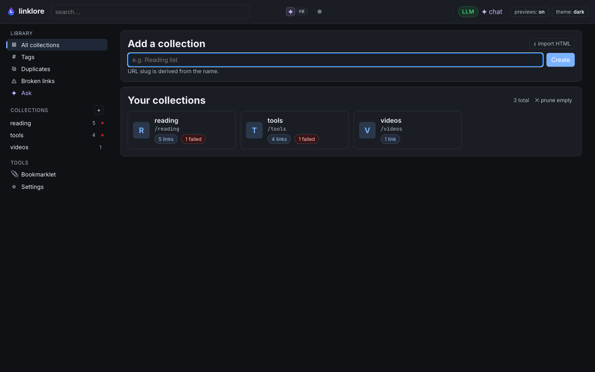

# Linklore

[](https://github.com/gabriele-mastrapasqua/linklore/actions/workflows/test.yml)
[](https://github.com/gabriele-mastrapasqua/linklore/actions/workflows/release.yml)
[](#tests)
[](https://goreportcard.com/report/github.com/gabriele-mastrapasqua/linklore)
[](go.mod)
[](LICENSE)
[](#privacy)

> **Bookmarks you actually own.** A local-first, single-binary library for
> the links you save — full-text + semantic search across everything,
> a private RAG chat grounded on your own content, four view modes,
> RSS/Atom subscriptions, dead-link checker, drag-and-drop. SQLite under
> the hood. No accounts. No SaaS. No telemetry.
>
> **One Go binary. One SQLite file.** No Node, no npm, no JS build
> chain, no Docker compose, no Postgres, no Redis. The whole thing
> is ~14 MB and starts in under a second.



> Screenshots above and below are taken from a curated demo library
> generated by `make seed-demo` — 10 public links across 3 collections,
> nothing personal.

---

## Why

Browser bookmarks rot. Read-later apps lock your data behind an account.
Self-hosted bookmark managers ship a Docker compose, a Postgres, a
Redis, and a JS build chain.

Linklore is one Go binary and one SQLite file. Open it, paste a URL,
forget it. When you want to find something — type, or ask the AI in
plain language. When you want to leave — copy the SQLite file. That's
the migration.

---

## Highlights

| | |
|---|---|
| **Capture** | Smart-add (link or RSS, same input). Bookmarklet. Netscape import/export round-trips with Chrome/Firefox/Pocket/Pinboard/Raindrop. |
| **Organize** | Collections + tags + drag-and-drop. Four view modes (list / grid / headlines / moodboard). Type classifier per link. Duplicates view with URL canonicalisation. |
| **Read** | In-place reader drawer with size / width / theme toggles. Full reader page at `/links/:id/read`. |
| **Search** | FTS5 across title, description, summary, body. Semantic via embeddings (cosine in Go). Hybrid ranking. |
| **Chat** | RAG over your library, streaming, with `[src:N]` citations linking back to source links. Stella-style starter tiles when the log is empty. |
| **Per-link AI** | TL;DR + auto-tags generated on ingest (LLM optional — degrades to BM25-only without). |
| **UX** | ⌘K command palette, `j`/`k` keyboard nav, right-click context menu, sticky filters, light/dark/auto theme. |
| **Privacy** | Local-first by design. Zero outbound HTTP except the URLs you paste, the LLM you configured, and the feeds you subscribed to. |

---

## Screenshots

<table>
<tr>
<td width="50%"><strong>Collection (list view)</strong> — favicons, summaries, type chips, density toggles<br></td>
<td width="50%"><strong>RAG chat</strong> — Stella-style starter tiles, grounded in your library<br></td>
</tr>
<tr>
<td colspan="2"><strong>Reader drawer</strong> — slide-in preview with size / width / theme toggles and a TL;DR card<br></td>
</tr>
</table>

---

## Quick start

You need **Go 1.25+** and `make`. An LLM is optional — Linklore boots
cleanly without one.

```bash
git clone git@github.com:gabriele-mastrapasqua/linklore.git
cd linklore
make build           # ./bin/linklore (~14 MB)
make run             # serves on http://127.0.0.1:8080
```

Open `http://127.0.0.1:8080`. That's the whole onboarding.

Want a local LLM (RAG chat + per-link TL;DR)? Two extra steps:

```bash
make env-template    # cp .env.example → .env (skips if .env exists)
$EDITOR .env         # uncomment the Ollama or LiteLLM block
```

See **[Configuration](#configuration)** below for the env-var values.

### One-shot dev loop

```bash
make dev             # reset DB + build + run (handy when iterating)
make test            # full suite, race-enabled, fts5 tag — what CI runs
make check           # fmt + vet + lint + test (run before commit)
make smoke           # spin up server, hit health + create paths, tear down
make seed-demo       # populate ./data/linklore-demo.db with curated public links
make help            # show every target
```

### CLI

```bash
./bin/linklore serve   [--config configs/config.yaml]
./bin/linklore add     -c <slug> <url>
./bin/linklore reindex
```

---

## Configuration

Linklore splits config across two files with **strict, non-overlapping
responsibilities** so a `git add .` can't ever leak a secret:

| File | Holds | Tracked in git? |
|---|---|---|
| `configs/config.yaml` | Non-secret tunables. | ✓ committed |
| `.env`                | Secrets + per-machine values: LLM endpoint, API key, model names. | gitignored |

The `/settings` page reads the live config and writes LLM changes back
to `.env` only — yaml is **never** touched by the UI save path.

### What's in `configs/config.yaml`

Edit when you want to change a defaults; otherwise ignore it.

```yaml
server.addr                 # default 127.0.0.1:8080
database.path               # default ./data/linklore.db
worker.{concurrency, embed_batch_size, fetch_timeout_seconds}
extract.{headless_fallback, archive_html, min_readable_chars}
chunking.{target_tokens, overlap_tokens, min_tokens}   # RAG knobs
tags.{max_per_link, active_cap, reuse_distance}        # auto-tag caps
ui.{show_images_default, reader_font, reader_width}    # cosmetic defaults
```

### Pick an LLM backend (or skip)

`make env-template` (or `cp .env.example .env`) then uncomment one of
the blocks below.

**Ollama on localhost** (zero config beyond `ollama pull`):

```bash
ollama pull qwen3:14b
ollama pull nomic-embed-text
```

```ini
LINKLORE_LLM_BACKEND=ollama
LINKLORE_LLM_MODEL=qwen3:14b
LINKLORE_LLM_EMBED_MODEL=nomic-embed-text
# OLLAMA_HOST=http://localhost:11434     # default
```

**LiteLLM / OpenAI-compatible gateway** (LiteLLM, llama.cpp `server`,
vLLM — anything that speaks `/chat/completions` + `/embeddings`):

```ini
LINKLORE_LLM_BACKEND=litellm
LITELLM_BASE_URL=http://localhost:4000/v1
LITELLM_API_KEY=sk-...
LINKLORE_LLM_MODEL=qwen3:14b
LINKLORE_LLM_EMBED_MODEL=nomic-embed-text
```

**No LLM** (default — search degrades to BM25, chat shows a friendly
disabled banner, ingestion still fetches and extracts):

```ini
LINKLORE_LLM_BACKEND=none
```

### Precedence

```
process env  >  .env  >  configs/config.yaml  >  built-in defaults
```

A one-shot override always wins:

```bash
LINKLORE_LLM_BACKEND=none ./bin/linklore serve
```

### All env vars

```
LINKLORE_LLM_BACKEND          none | ollama | litellm
LINKLORE_LLM_MODEL            chat/summary model
LINKLORE_LLM_EMBED_MODEL      embedding model
LITELLM_BASE_URL              OpenAI-compatible gateway URL
LITELLM_API_KEY               bearer token (sent only when set)
OLLAMA_HOST                   ollama daemon URL
LINKLORE_ADDR                 server bind address
LINKLORE_DB_PATH              SQLite path
LINKLORE_WORKER_CONCURRENCY   parallel ingest workers
```

---

## Keyboard shortcuts

| Key | Action |
|---|---|
| `⌘K` / `Ctrl+K` | Command palette |
| `j` / `↓`        | Next card |
| `k` / `↑`        | Previous card |
| `↵`              | Open in preview drawer |
| `x`              | Toggle bulk-selection on focused card |
| `del`            | Delete focused card |
| `/`              | Focus the search |
| `?`              | Show shortcut overlay |
| `esc`            | Dismiss overlay / drawer / clear selection |
| Right-click row  | Context menu (Preview / Open / Copy URL / ✦ Ask / Delete) |

---

## Architecture

```
cmd/linklore/        single binary: serve | add | reindex
internal/
  archive/           gzipped raw-HTML snapshots
  chat/              RAG context builder + streaming SSE
  chunking/          paragraph + heading chunker
  classify/          URL → article|video|image|audio|document|book
  config/            yaml + env override loader (LLM = env-only)
  embed/             []float32 ↔ BLOB encode + cosine in Go
  events/            in-process pub/sub for SSE
  extract/           HTTP fetch + readability + html→md
  feed/              outbound Atom export per collection
  feedimport/        gofeed-based RSS/Atom importer + auto-discover
  llm/               Backend interface: ollama, litellm, fake
  netscape/          Netscape Bookmark File reader/writer
  reader/            content_md → sanitised HTML
  search/            FTS5 + cosine hybrid ranking
  server/            http.ServeMux + handlers + html/template
  storage/           SQLite WAL + FTS5 + embeddings (BLOB) + migrations
  summarize/         LLM TL;DR + auto-tags JSON pipeline
  tags/              slugify, dedupe, normalisation
  urlnorm/           URL canonicalisation for duplicate detection
  worker/            background fetch / extract / summary / embed queue
web/
  templates/         html/template — base.html + per-page + partials/
  static/            app.css + small JS files (no build step)
configs/config.yaml  non-secret tunables
.env                 LLM endpoint + secrets (gitignored)
data/linklore.db     created on first boot
```

**Stack**: Go stdlib `net/http.ServeMux` (Go 1.22+ pattern routing),
`html/template`, SQLite via `mattn/go-sqlite3` with FTS5 + WAL,
HTMX + a handful of small JS modules under `web/static/`. No Node, no
npm, no JS build chain.

---

## Tests

```bash
make test       # full suite, -race, fts5 tag, count=1 — what CI runs
make cover      # writes coverage.html + prints total
make cover-pkg  # per-package summary, no HTML
```

Current total: ~75% across 23 packages. The 0%-coverage areas are
the `runServe` boot orchestration (subprocess-only) and the LLM
client wrappers that are exercised end-to-end via `make smoke`.

---

## Privacy

- The SQLite file at `./data/linklore.db` is the source of truth.
  Back it up via Syncthing / iCloud Drive / scp / `sqlite3 .backup`.
  No cross-device sync built in — by design.
- Linklore makes outbound HTTP only to: (1) URLs you paste, (2) the
  LLM backend you configured, (3) RSS/Atom feeds you subscribed to.
  No telemetry. No analytics. No "anonymous usage stats".
- Single-user. No login, no accounts. Binds to `127.0.0.1` by default.

---

## Contributing

Personal project, but PRs that fit the spirit (local-first,
single-user, no SaaS, no JS build) are welcome.

1. `make check` — fmt + vet + lint + race test.
2. New features go behind a config flag if their cost is non-trivial.
3. New tests for new features. Bar: "could a regression slip past the
   existing suite?" If yes, add the test.

---

## License

MIT. See [`LICENSE`](LICENSE).

Linklore is named after Linkjam, the proto-bookmark-manager you would
have built if you'd stayed up one Saturday in 2008.
